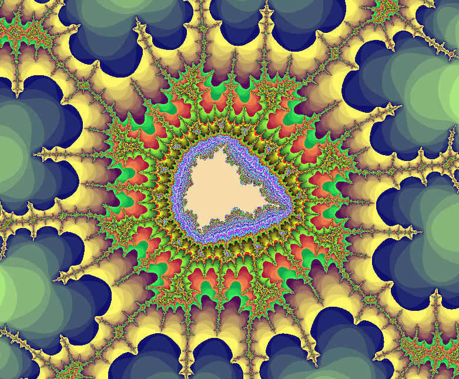

# Fractol

Fractol is a project developed as part of the cursus at 42 school. It is a program designed to render fractal shapes, including Mandelbrot and Julia set fractals, along with an H tree fractal. The program utilizes multithreading to enhance rendering performance.

## Description

Fractol allows users to explore and visualize various fractal shapes interactively. Users can navigate through the fractals, change iteration numbers, switch color palettes, and even switch to a Julia set's point. The program provides intuitive controls to manipulate and observe the fractals in real-time.


## Features

- Rendering of Mandelbrot fractal
- Rendering of Julia set fractals
- Rendering of an H tree fractal
- Multithreading support for efficient rendering (only for Mandelbrot and julia fractals)
- Interactive controls for navigation and customization

## Commands

- **Left Click**: Drag and drop to navigate through the fractal
- **Right Click**: Switch to a Julia set's point (only in Mandelbrot, right click in Julia set to go back to Mandelbrot)
- **Arrows <- ->**: Navigate the fractal
- **+/-**: Increase/Decrease iteration number
- **:/!** or **[/]** (azerty vs qwerty): Decrease/Increase number of rendering threads (optimal number is usually 256 threads)
- **o/p**: Change color palette
- **g**: Switch between H-tree fractal and Julia/Mandelbrot
- **t**: Trigger paint mode for H tree (psychedelic effect guaranteed !!)

## Installation

To compile the Fractol project, clone the repository and run the `make` command.

```
git clone <repository_url>
cd fractol
git submodule init libft
git submodule update libft
make
```

## Usage

Once compiled, you can run the Fractol program by executing the binary file with the desired fractal shape as an argument.

```
./fractol [0=julia/1=mandelbrot/2=htree]
```

Default settings such as window resolution, printing FPS on/off,
and initial constant values for julia set are defined in `includes/fractol.h`





